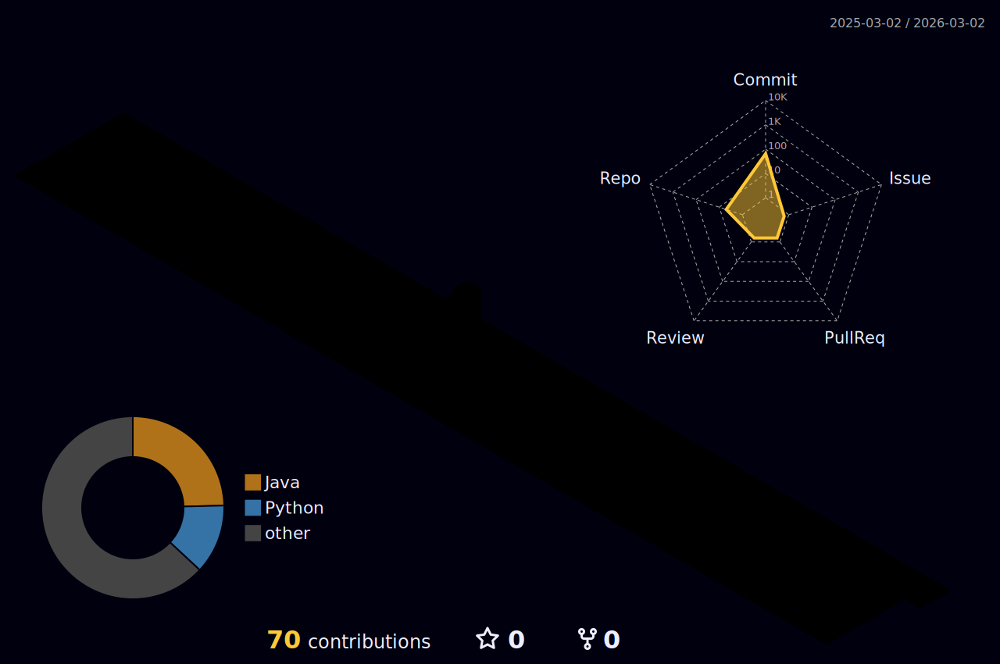

<h1 align="center">
  Jiyong Kim
  <p align="center", style="font-size:17px; color:gray; font-weight:400;"">
    김지용
  </p>
</h1>

<p align="center">
  Back-End Developer in the making!
</p>

```Java
class Zyonge {
    String birth = "2004";
    String nation = "South Korea";
    String university = "Tech University of Korea (TUK)";
    String major = "IT Administration";
    String studying = "Computer Engineering";
    String nowInterested = "Web Development";
};
//Email: kimjiyong0819@gmail.com
```
## Tech Stack
### 1. Programming Languages
<div>
  
  
  
  
</div>

### 2. Frameworks & Runtimes
<div>
  
  
</div>

### 3. Database
<div>
  
</div>

### 4. Platforms & Tools
<div>
  
  
</div>

### 5. OS
<div>
  
  
</div>

## Real World Languages
<div>
  
  
</div>

## Goals
- Achieve advanced proficiency in web development.
- Strengthen understanding of data structures and database management through hands-on practice.
- Gain practical experience by operating real-world projects.

## Repositories Overview
<details>
  <summary>Spring Workflow</summary>

- [SpringBootPractice](https://github.com/ZYONGE/SpringBootPractice.git)
- [JSPLogInPractice](https://github.com/ZYONGE/JSPLogInPractice.git)

</details>

<details>
  <summary>Java Syntax Practice</summary>

- [JavaContactPractice](https://github.com/ZYONGE/JavaContactPractice.git)
- [JavaCalendarPractice](https://github.com/ZYONGE/JavaCalendarPractice.git)

</details>

<details>
  <summary>P.S with Python</summary>

- [PythonProblemSolvingLog](https://github.com/ZYONGE/PythonProblemSolvingLog.git)

</details>

## GitHub Activity Graph
  <picture>
    <source media="(prefers-color-scheme: dark)" srcset="./profile-3d-contrib/profile-night-rainbow.svg">
    
  </picture>
