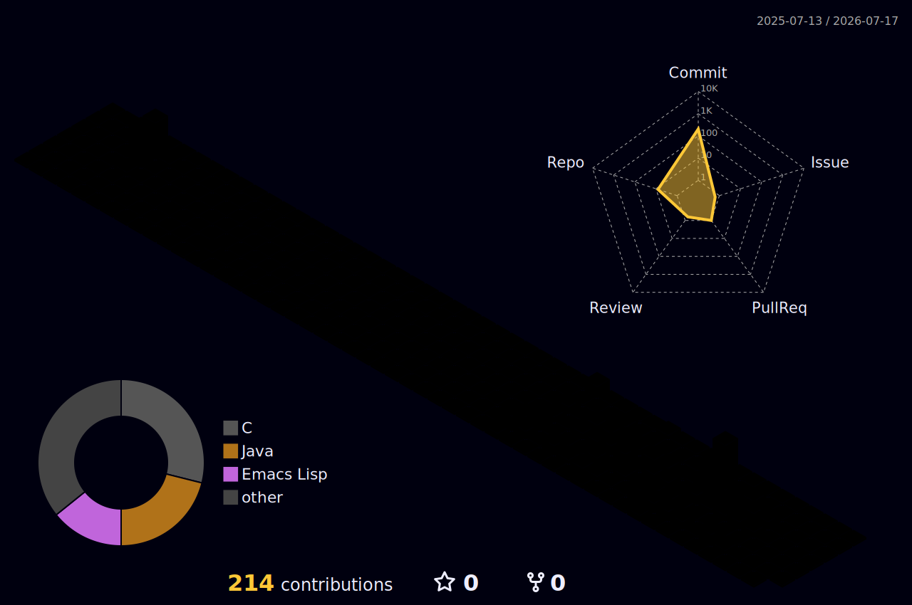

<h1 align="center">
  Jiyong Kim
</h1>

```Java
class Zyonge{
    String birth = "2004";
    String nation = "South Korea";
    String university = "Tech University of Korea (TUK)";
    String major = "IT Administration";
    String studying = "Computer Engineering";
    String nowInterested = "Web Development";
};
//Business Email:kimjiyong0819@gmail.com
```
## Tech Stack
### 1. Programming Languages
<div>
  
   
  
  
</div>

### 2. Frameworks & Runtimes
<div>
  
  
</div>

### 3. Database
<div>
  
  
</div>

### 4. Platforms & Editior
<div>
  
  
  
</div>

### 5. AI Agent
<div>

</div>

## Real World Languages
<div>
  
  
</div>

## Subject
- Store and review the practice exercises from University courses.

## Repositories Overview
<details>
  <summary>WebProgramming and Database</summary>

- [DynamicWebProject](https://github.com/ZYONGE/DynamicWebProject.git)
- [DatabaseDesign](https://github.com/ZYONGE/DatabaseDesign.git)

</details>

<details>
  <summary>Unix and Data Structure</summary>

- [BasicUnix](https://github.com/ZYONGE/BasicUnix.git)
- [DataStructure](https://github.com/ZYONGE/DataStructure.git)
</details>

<details>
  <summary>Java Syntax</summary>

- [JavaContactPractice](https://github.com/ZYONGE/JavaContactPractice.git)
- [JavaCalendarPractice](https://github.com/ZYONGE/JavaCalendarPractice.git)
</details>


## Activity Graph
  <picture>
    <source media="(prefers-color-scheme: dark)" srcset="./profile-3d-contrib/profile-night-rainbow.svg">
    
  </picture>
