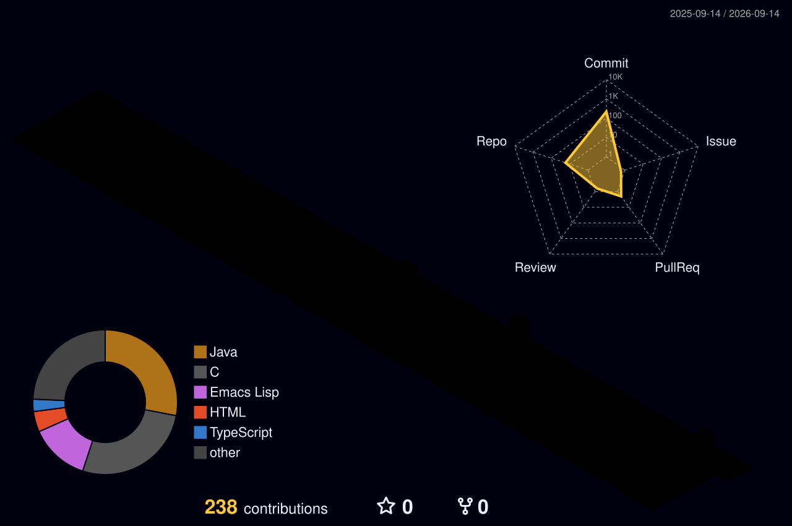

<h1 align="center">ZYONGE</h1>
<h3 align="center">Application Engineering</h3>

<p align="center">
  Storing and reviewing practice exercises from university courses,<br />
  and managing both team and personal projects.
</p>

<p align="">
  <a href="mailto:zyonge.projects@gmail.com">
    
  </a>
</p>

## Ongoing Repositories

<table>
  <tr>
    <td>
      <a href="https://github.com/ZYONGE/DataManagement" title="데이터 관리">
        
      </a>
    </td>
    <td>
      <a href="https://github.com/ZYONGE/DatabaseBasic" title="데이터베이스">
        
      </a>
    </td>
  </tr>
  <tr>
    <td>
      <a href="https://github.com/ZYONGE/WebApplication" title="웹프로그래밍응용">
        
      </a>
    </td>
    <td>
      <a href="https://github.com/ZYONGE/JavaBasic" title="자바">
        
      </a>
    </td>
  </tr>
</table>

## Tech Stack

### Programming Languages
<div>
  
  
  
  
  
  
  
  
</div>

### Frameworks & Runtimes
<div>
  
  
</div>

### Database
<div>
  
</div>

### Version Control
<div>
  
</div>

### IDE
<div>
  
  
</div>

### AI Agents
<div>
  
</div>

## About Me

```java
class Zyonge {
    String birth = "2004";
    String nation = "South Korea";

    String university = "Tech University of Korea (TUK)";
    String major = "IT Administration";
    String double_major = "Computer Engineering";

    String now_Ongoing = "Web Application Development";
    String specialty = "AI Agent, Cloud Computing";
}
```

### Languages
<!--
  숙련도를 함께 표기하려면 배지 텍스트를 두 칸으로 나누면 됩니다.
  예) .../badge/Korean-Native-...  /  .../badge/English-Business-...
-->
<div>
  
  
</div>

## Activity Graph

<picture>
  <source media="(prefers-color-scheme: dark)" srcset="./profile-3d-contrib/profile-night-rainbow.svg">
  <source media="(prefers-color-scheme: light)" srcset="./profile-3d-contrib/profile-green.svg">
  
</picture>
