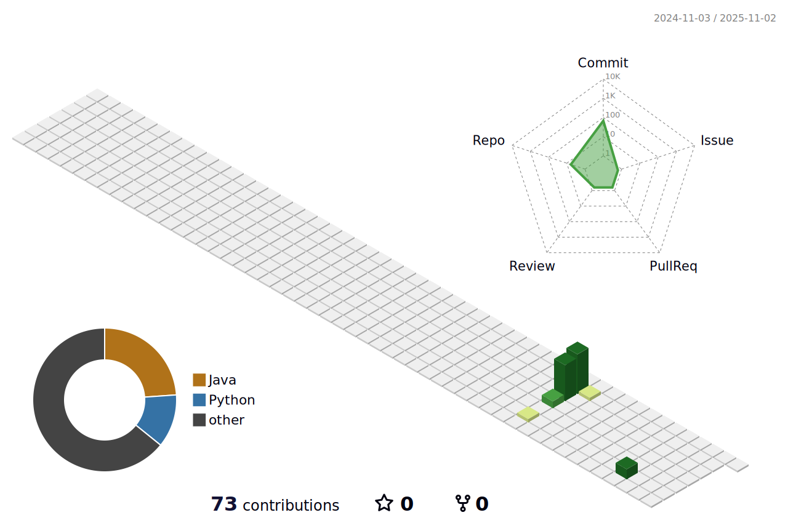

<h1 align="center">
  Jiyong Kim
</h1>

<p align="center">
  Back-End Developer in the making!
</p>

```javascript
const ZYONGE = {
  birthYear: 2004,
  nation: "South Korea",
  university: "Tech University of Korea (TUK)",
  major: "IT Administration",
  studying: "Computer Engineering",
  nowInterested: "Web Development"
};
```

## Programming Languages
<div>
  
  
  
  
</div>

## Frameworks & Runtimes
<div>
  
  
</div>

## Real World Languages
<div>
  
  
</div>

## Goals
- Build advanced proficiency in web development.
- Hands-on practice with data structures and database management.
- Gain practical experience by operating real-world projects.

## Work Portfolio
#### Currently ongoing project
- [SpringBootPractice](https://github.com/ZYONGE/SpringBootPractice.git) - A beginner-level Spring Boot project for API basics.

<details>
  <summary>Spring Workflow</summary>

- [SpringBootPractice](https://github.com/ZYONGE/SpringBootPractice.git) - A beginner-level Spring Boot project for API basics.

</details>

<details>
  <summary>Java Syntax Practice</summary>

- [JavaContactPractice](https://github.com/ZYONGE/JavaContactPractice.git) - Terminal-based Java Contact application
- [JavaCalendarPractice](https://github.com/ZYONGE/JavaCalendarPractice.git) - Simple Java Syntax Practice Code With Calendar Library.

</details>

<details>
  <summary>P.S With PyThon</summary>

- [PythonProblemSolvingLog](https://github.com/ZYONGE/PythonProblemSolvingLog.git) - log of Solutions of Algorithm Problems Written in Python

</details>

## Overview

<p align="center">
  <picture>
    <source media="(prefers-color-scheme: dark)" srcset="./profile-3d-contrib/profile-night-view.svg" />
    
  </picture>
</p>
